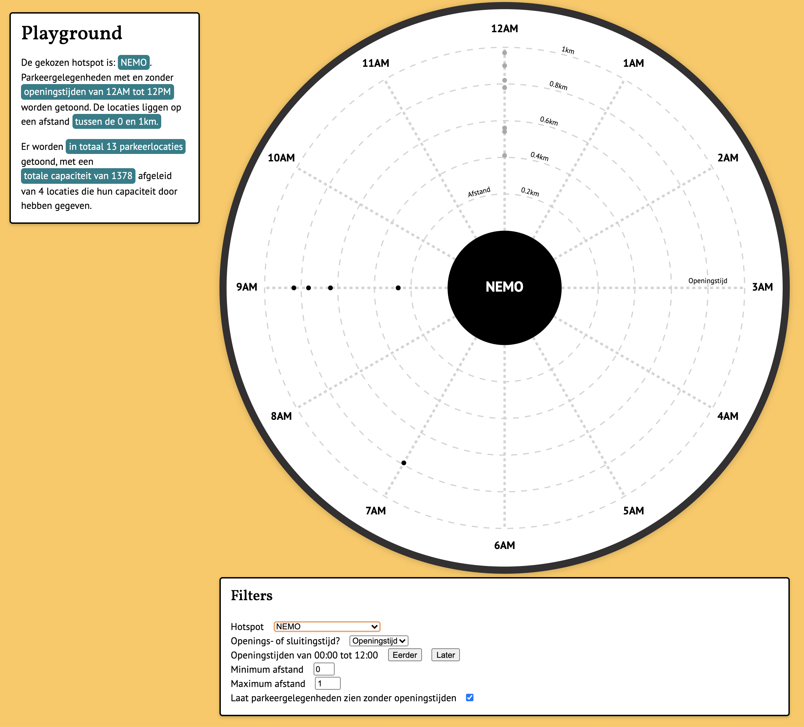

# Frontend Applications

[Wiki](https://github.com/theonejonahgold/frontend-applications/wiki) • [Concept](#concept) • [Data story](https://frontend-applications.jonahmeijers.nl)



This repo is created to use the data processed in the [functional-programming repo](https://github.com/theonejonahgold/functional-programming), to create a data visualisation using D3. The data consists of parking data gathered by the RDW (Dutch Vehicle Authority), which can bring many great insights when put into a data visualisation. Read more about the assingment in my [Debriefing](https://github.com/theonejonahgold/functional-programming/wiki/Debriefing-🐒), and read about the concept [further below](#concept)

## Learning goals

- Understanding how D3 works
- Using D3 to create a data visualisation with data I myself have processed.

## Getting started

### Setting up the repo

To get started, you first need to clone the repo and install the dependencies:

```bash
git clone https://github.com/theonejonahgold/frontend-data
cd frontend-data
yarn install || yarn
```

### Available commands

```bash
yarn dev   # Opens a dev server and watches src files.
yarn build # Builds a bundle for the website.
yarn lint  # Runs ESLint on files to check for consistent code.
```

## Concept

[Extended version](https://github.com/theonejonahgold/frontend-data/wiki/Concept-🦧)

### Main Question

What is the relation between distance and availability of parking places to hot-spots in the city?

### Research questions

- How close are parking areas to the hot-spot?
- What are the average hours of the parking areas?
- What are the capacities of the parking areas?

### Used variables

The used variables are available through [this link](https://github.com/theonejonahgold/frontend-data/wiki/Concept-🦧#gebruikte-variabelen).

## D3 functionalities used

- [lineRadial](https://github.com/d3/d3-shape/blob/master/README.md#_lineradial)
- [scaleLinear](https://github.com/d3/d3-scale/blob/master/README.md#scalelinear)
- [select/selectAll](https://github.com/d3/d3-selection/blob/master/README.md#select)
- [range](https://github.com/d3/d3-array/blob/master/README.md#range)

## Functional programming principles applied

- [Composition](https://github.com/cmda-tt/course-20-21/blob/master/examples/functional-patterns/composition.md)
- [Functional purity](https://github.com/cmda-tt/course-20-21/blob/master/examples/functional-patterns/impure.md)
- [Data immutability](https://github.com/cmda-tt/course-20-21/blob/master/examples/functional-patterns/immutability.md)
- [Currying](https://en.wikipedia.org/wiki/Currying)
- [Higher order functions](https://github.com/cmda-tt/course-20-21/blob/master/examples/functional-patterns/ho-functions.md)

## Tools used

- [Svelte](https://svelte.dev)
- [D3](https://d3js.org)
- [ramda](https://github.com/ramda/ramda)
- [NodeJS](https://nodejs.org/en/)
- [Snowpack](https://snowpack.dev)
- [Yarn Classic](https://classic.yarnpkg.com/lang/en/)
- [ESLint](https://eslint.org)
